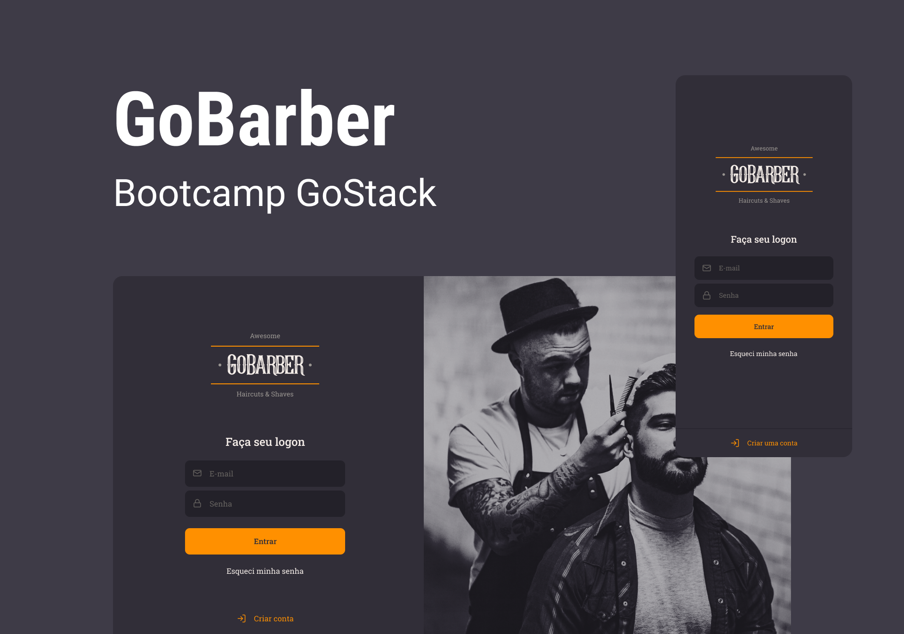

  

 
 

  

    <a href="#-sobre"> Sobre </a> |
    <a href="#-prévia"> Prévia </a> |
    <a href="#-tecnologias"> Tecnologias </a> |
    <a href="#-licença"> Licença </a> 
  

## 📚 Sobre

Projeto desenvolvido durante o bootcamp GoStack 11 da [Rocketseat](https://github.com/Rocketseat).

O projeto tem por objetivo criar uma aplicação que facilite o gerenciamento de agenda de barbeiros e o acesso aos agendamentos para os clientes e para isso foram desenvolvidos a API, a aplicação Web  e um aplicativo.

Para acessar a api, [clique aqui](https://github.com/thudf/gobarber-api).  

Para acessar a aplicação web, [clique aqui](https://github.com/thudf/gobarber-web).  

Para acessar o aplicativo, [clique aqui](https://github.com/thudf/gobarber-app).

## 💡 Prévia

 
  

## 🚀 Tecnologias

As princiais tecnologias utilizadas:

- [NodeJS](https://nodejs.org/en/)
- [ReactJS](https://pt-br.reactjs.org/)
- [ExpressJS](https://expressjs.com/pt-br/)
- [JWT](https://jwt.io/)
- [Yup](https://github.com/jquense/yup)
- [Styled-Components](https://styled-components.com/)

## 🖊 Licença

Este projeto é desenvolvido sob a licença MIT. Veja o arquivo [LICENSE](LICENSE) para saber mais detalhes.

---

  
por <strong> Arthur D'Afonseca e Silva</strong> 

